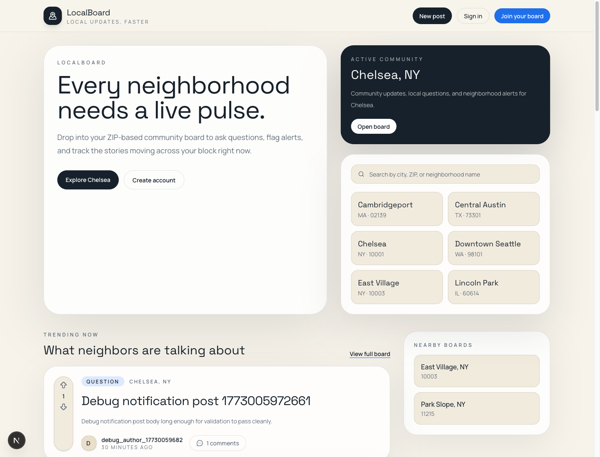
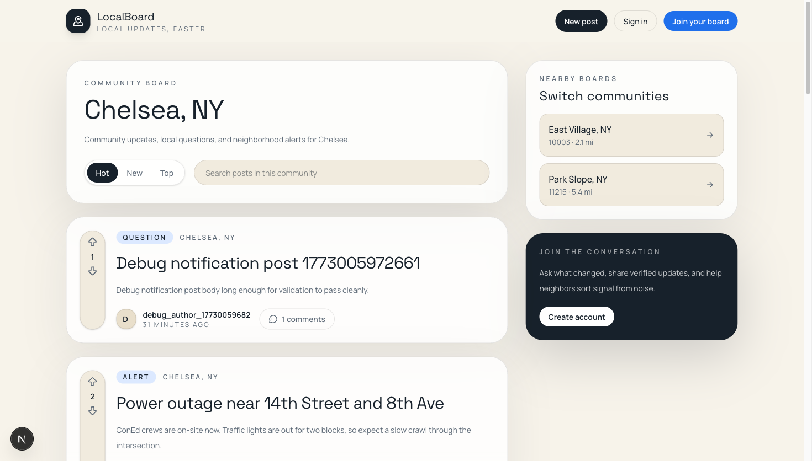
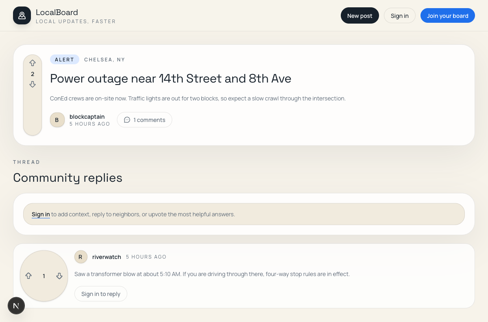

# LocalBoard

LocalBoard is a full-stack, location-based discussion platform built with Next.js and Supabase. Each ZIP-backed community gets its own board where residents can share updates, ask questions, flag alerts, and discuss what is happening nearby.

## Screenshots

### Landing page



### Community feed



### Discussion thread



## Stack

- Next.js 16 App Router
- React 19
- Tailwind CSS 4
- Supabase Auth, Postgres, Realtime, and Storage
- Vitest unit tests
- Playwright end-to-end tests
- Vercel-ready deployment

## Core product surface

- ZIP-based community boards with nearby community switching
- Email and password authentication
- Posts for `question`, `update`, `alert`, and `discussion`
- Threaded comments with voting
- Reputation and moderation primitives
- In-app notifications
- Admin report queue and moderation actions
- Responsive UI for desktop and mobile

## Startup-grade hardening

- Database-backed rate limiting for auth and write APIs
- IP throttling with hashed request identifiers
- Verified-email enforcement for protected actions
- Duplicate-content fingerprinting for posts, comments, and reports
- Spam heuristics for repeated text, excessive links, and noisy submissions
- Optional Cloudflare Turnstile support for sign-up and sign-in

## Quick start

```bash
npm install
cp .env.example .env.local
npm run dev
```

Open [http://localhost:3000](http://localhost:3000).

## Run with Supabase

```bash
supabase start
supabase db reset
```

Required environment variables:

- `NEXT_PUBLIC_SUPABASE_URL`
- `NEXT_PUBLIC_SUPABASE_ANON_KEY`
- `SUPABASE_SERVICE_ROLE_KEY`
- `ADMIN_EMAIL_ALLOWLIST`
- `RATE_LIMIT_SALT`
- `CRON_SECRET`

Optional abuse-protection environment variables:

- `NEXT_PUBLIC_TURNSTILE_SITE_KEY`
- `TURNSTILE_SECRET_KEY`

If you are applying SQL manually to a hosted Supabase project, make sure the latest abuse-protection migration is included:

- [20260308190000_abuse_protection.sql](/Users/tk/dev/project-one/supabase/migrations/20260308190000_abuse_protection.sql)

## Verification

```bash
npm run typecheck
npm run lint
npm run test:unit
npm run test:e2e
npm run build
```

## Docs

- [Local setup](/Users/tk/dev/project-one/docs/local-setup.md)
- [Architecture](/Users/tk/dev/project-one/docs/architecture.md)
- [Deployment](/Users/tk/dev/project-one/docs/deployment.md)
